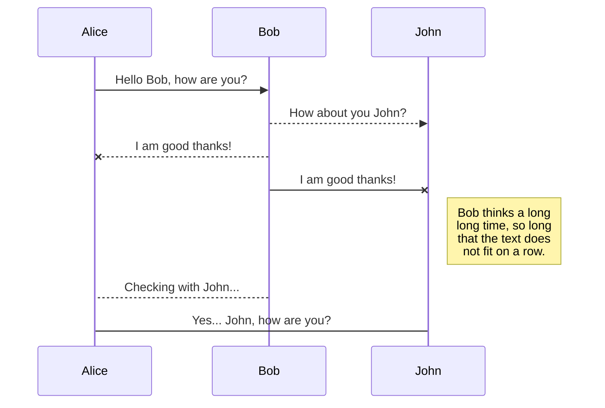
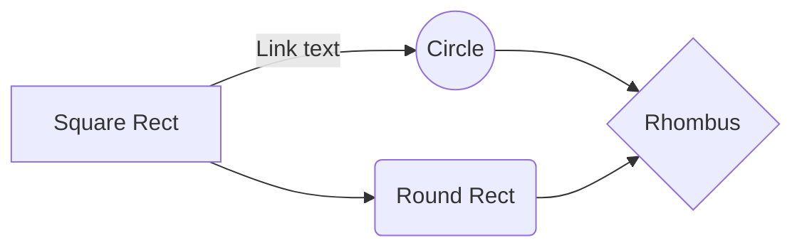

# Bienvenido a Finite! 
>  La criptomoneda que cambiará el juego con el respaldo de valor generado por computadoras cuánticas

Finite es una criptomoneda libre y descentralizada con respaldo de valor conformado por el acervo de la humanidad. Basada en la **computacion cuantica**, inteligencia artificial y la cadena de bloques, Finite en su **mision** pretende ser el alicate que desmantele el alambre de puas que se ha tejido alrededor de la propiedad intelectual y en su **vision** pretende ser protector y testigo de nuestro legado como humanidad. 

## Secciones
> Finite es un proyecto Open Source. Consideramos la transparencia y apertura de todas las etapas del proyecto un pilar fundamental. Es por esto, que utilizamos @Github en forma publica para desarrollar todas nuestras estrategias, RoadMap y tecnologias.

+  [Marketing Strategy (ChatGPT)](http://handlebarsjs.com/)
## Marketing Strategy (ChatGPT)
1.  **Foco en la misión**: Destacar cómo la criptomoneda está respaldada por el valor generado por el acervo de la humanidad y cómo eso la hace diferente de otras criptomonedas.
>El enfoque en la misión de la criptomoneda es clave para diferenciarse de otras criptomonedas en el mercado. La idea aquí es resaltar cómo el respaldo en el valor generado por la humanidad es único y brinda una mayor seguridad y estabilidad a la criptomoneda. Se pueden crear mensajes de marketing que destaquen las características distintivas de la criptomoneda y su respaldo en el valor generado por la humanidad
3.  **Colaboraciones con museos y instituciones culturales**: Aliarse con museos y otras instituciones culturales para ayudar a promocionar la criptomoneda y su valor intrínseco.
    
4.  **Campañas en redes sociales**: Utilizar las redes sociales para crear conciencia sobre la criptomoneda y su misión única.
    
5.  **Eventos culturales y patrocinios**: Patrocinar eventos culturales y festivales para conectar con un público interesado en la cultura y el arte.
    
6.  **Programas de recompensas**: Ofrecer recompensas a los usuarios que inviertan en la criptomoneda o la utilicen para adquirir bienes culturales y artísticos.
    
7.  **Educación financiera**: Proporcionar recursos educativos para ayudar a los usuarios a entender cómo funciona la criptomoneda y cómo puede ser una inversión sólida.
    
8.  **Influencers y embajadores**: Identificar a influencers y embajadores en la comunidad  para ayudar a promocionar la criptomoneda.

## WEB-SITE 
#### Secciones  (ChatGPT)
1.  **Explicación clara y concisa del concepto**: Una sección dedicada a explicar de manera clara y concisa cómo funciona la criptomoneda y su respaldo en el valor generado por las computadoras cuánticas.
    
2.  **Visualizaciones interactivas**: Utilizar visualizaciones interactivas para ayudar a los usuarios a comprender el proceso detrás del respaldo en el valor generado por las computadoras cuánticas.
    
3.  **Sección de preguntas frecuentes**: Una sección de preguntas frecuentes para responder a las preocupaciones y dudas de los usuarios.
    
4. **Demostraciones en tiempo real**: Demostraciones en tiempo real de cómo las computadoras cuánticas generan valor y cómo ese valor respalda la criptomoneda.
    
5. **Blog y recursos educativos**: Un blog y recursos educativos para ayudar a los usuarios a comprender mejor cómo funciona la criptomoneda y su respaldo en el valor generado por las computadoras cuánticas.
    
6.  **Seguimiento de noticias y desarrollos**: Una sección para seguir las últimas noticias y desarrollos en torno a la criptomoneda y el uso de computadoras cuánticas en el respaldo de valor.
    
7.  **Integración con redes sociales**: Integración con redes sociales para permitir a los usuarios compartir información y noticias sobre la criptomoneda y su respaldo en el valor generado por las computadoras cuánticas.
#### Ideas para titulos de la Web (ChatGPT)

> puedes darme ideas para el titulo de una web sobre una criptomoneda que utiliza computacion cuantica
1.  "Finite: La moneda digital del futuro"
2.  "El poder de la computación cuántica en tus manos"
3.  "Bienvenido a la era de la criptomoneda cuántica"

> 20 ideas mas, la criptomoneda utiliza computadoras cuanticas para generar respaldo valor, creando todas las posibles imagenes de la humanidad.
>
4.  "La moneda cuántica: El futuro de la seguridad financiera"
5.  "Finite: La criptomoneda con respaldo ilimitado"
6.  "Finite: Una moneda única en el mundo"
7.  "El futuro de la inversión: Finite"
8.  "Finite: La moneda que abre puertas a un nuevo mundo"
9.  "Finite: La criptomoneda más avanzada del planeta"
10.  "La moneda cuántica: Una alternativa segura y eficiente"
11.  "Finite: Una nueva forma de valorar el dinero"
12.  "Finite: Un nuevo enfoque en las transacciones digitales"
13.  "Finite: la moneda cuántica: Una apuesta segura en un mundo incierto"
14.  "Fintie: La moneda con respaldo ilimitado"
15.  "Finite: La criptomoneda que cambiará el mundo"
16.  "Finite: La moneda que garantiza tu futuro financiero"
17.  "Finite: Una inversión sólida para el futuro"
18.  "Finite: La criptomoneda del futuro, hoy"
19.  "Finite: Una nueva forma de hacer negocios"
20.  "Finite: La criptomoneda más innovadora del mercado"
21.  "Finite: Una moneda con un futuro brillante"
22.  "Finite: La moneda que redefine la seguridad financiera"
23.  "Finite: Una inversión que vale la pena"
> 12.  "Finite: La criptomoneda que cambiará el juego con el respaldo de valor generado por computadoras cuánticas"

Este título enfatiza el hecho de que la criptomoneda no solo es revolucionaria en términos de su uso de computadoras cuánticas, sino que también tiene el beneficanso añadido de tener su valor respaldado por la tecnología avanzada. El uso de computadoras cuánticas lo distingue de otras criptomonedas y lo convierte en un cambio de juego en la industria, de ahí el uso de "cambiar el juego".

## Switch to another file

All your files and folders are presented as a tree in the file explorer. You can switch from one to another by clicking a file in the tree.

## Rename a file

You can rename the current file by clicking the file name in the navigation bar or by clicking the **Rename** button in the file explorer.

## Delete a file

You can delete the current file by clicking the **Remove** button in the file explorer. The file will be moved into the **Trash** folder and automatically deleted after 7 days of inactivity.

## Export a file

You can export the current file by clicking **Export to disk** in the menu. You can choose to export the file as plain Markdown, as HTML using a Handlebars template or as a PDF.

# Synchronization

Synchronization is one of the biggest features of StackEdit. It enables you to synchronize any file in your workspace with other files stored in your **Google Drive**, your **Dropbox** and your **GitHub** accounts. This allows you to keep writing on other devices, collaborate with people you share the file with, integrate easily into your workflow... The synchronization mechanism takes place every minute in the background, downloading, merging, and uploading file modifications.

There are two types of synchronization and they can complement each other:

- The workspace synchronization will sync all your files, folders and settings automatically. This will allow you to fetch your workspace on any other device.
	> To start syncing your workspace, just sign in with Google in the menu.

- The file synchronization will keep one file of the workspace synced with one or multiple files in **Google Drive**, **Dropbox** or **GitHub**.
	> Before starting to sync files, you must link an account in the **Synchronize** sub-menu.

## Open a file

You can open a file from **Google Drive**, **Dropbox** or **GitHub** by opening the **Synchronize** sub-menu and clicking **Open from**. Once opened in the workspace, any modification in the file will be automatically synced.

## Save a file

You can save any file of the workspace to **Google Drive**, **Dropbox** or **GitHub** by opening the **Synchronize** sub-menu and clicking **Save on**. Even if a file in the workspace is already synced, you can save it to another location. StackEdit can sync one file with multiple locations and accounts.

## Synchronize a file

Once your file is linked to a synchronized location, StackEdit will periodically synchronize it by downloading/uploading any modification. A merge will be performed if necessary and conflicts will be resolved.

If you just have modified your file and you want to force syncing, click the **Synchronize now** button in the navigation bar.

> **Note:** The **Synchronize now** button is disabled if you have no file to synchronize.

## Manage file synchronization

Since one file can be synced with multiple locations, you can list and manage synchronized locations by clicking **File synchronization** in the **Synchronize** sub-menu. This allows you to list and remove synchronized locations that are linked to your file.

# Publication

Publishing in StackEdit makes it simple for you to publish online your files. Once you're happy with a file, you can publish it to different hosting platforms like **Blogger**, **Dropbox**, **Gist**, **GitHub**, **Google Drive**, **WordPress** and **Zendesk**. With [Handlebars templates](http://handlebarsjs.com/), you have full control over what you export.

> Before starting to publish, you must link an account in the **Publish** sub-menu.

## Publish a File

You can publish your file by opening the **Publish** sub-menu and by clicking **Publish to**. For some locations, you can choose between the following formats:

- Markdown: publish the Markdown text on a website that can interpret it (**GitHub** for instance),
- HTML: publish the file converted to HTML via a Handlebars template (on a blog for example).

## Update a publication

After publishing, StackEdit keeps your file linked to that publication which makes it easy for you to re-publish it. Once you have modified your file and you want to update your publication, click on the **Publish now** button in the navigation bar.

> **Note:** The **Publish now** button is disabled if your file has not been published yet.

## Manage file publication

Since one file can be published to multiple locations, you can list and manage publish locations by clicking **File publication** in the **Publish** sub-menu. This allows you to list and remove publication locations that are linked to your file.

# Markdown extensions

StackEdit extends the standard Markdown syntax by adding extra **Markdown extensions**, providing you with some nice features.

> **ProTip:** You can disable any **Markdown extension** in the **File properties** dialog.

## SmartyPants

SmartyPants converts ASCII punctuation characters into "smart" typographic punctuation HTML entities. For example:

|                |ASCII                          |HTML                         |
|----------------|-------------------------------|-----------------------------|
|Single backticks|`'Isn't this fun?'`            |'Isn't this fun?'            |
|Quotes          |`"Isn't this fun?"`            |"Isn't this fun?"            |
|Dashes          |`-- is en-dash, --- is em-dash`|-- is en-dash, --- is em-dash|

## KaTeX

You can render LaTeX mathematical expressions using [KaTeX](https://khan.github.io/KaTeX/):

The *Gamma function* satisfying $\Gamma(n) = (n-1)!\quad\forall n\in\mathbb N$ is via the Euler integral

$$
\Gamma(z) = \int_0^\infty t^{z-1}e^{-t}dt\,.
$$

> You can find more information about **LaTeX** mathematical expressions [here](http://meta.math.stackexchange.com/questions/5020/mathjax-basic-tutorial-and-quick-reference).

## UML diagrams

You can render UML diagrams using [Mermaid](https://mermaidjs.github.io/). For example, this will produce a sequence diagram:

And this will produce a flow chart:

